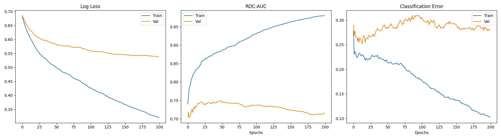
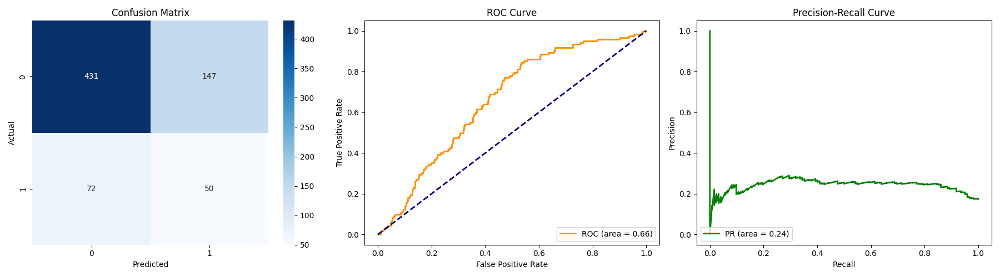
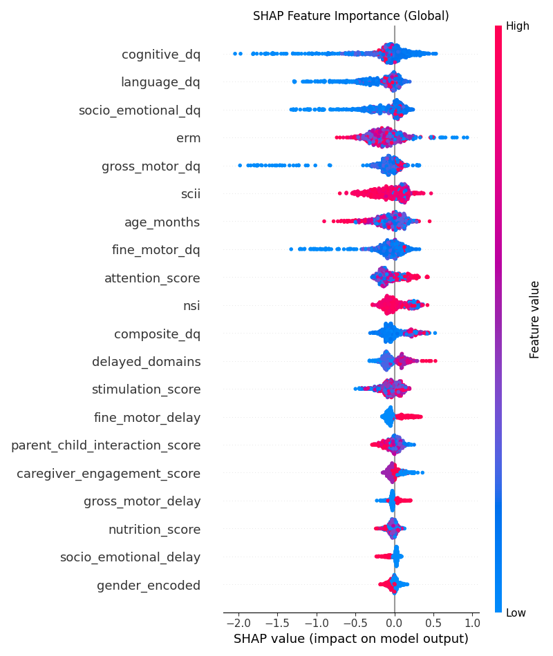

# 🧪 Professional ML Assessment Dashboard
*Generated on: 2026-02-20 05:36:21*

## 🟢 Model A: Autism Risk Classifier
### 🏥 Clinical Guideline Preview (New)
> [!NOTE]
> Model A now generates structured intervention pathways based on clinical markers. 

| Category | Objective | Sample Daily Step | Parent Guide |
| :--- | :--- | :--- | :--- |
| **Speech Therapy** | Improve verbal communication | Spend 10 mins naming household objects | Speak slowly and clearly |
| **Occupational Therapy** | Develop fine motor skills | Practice stacking blocks or nesting cups | Focus on grip strength |
| **Behavioral Therapy** | Enhance social engagement | Practice eye contact during play | Consistency is key |

### 📈 Training Progress
- **Timestamp**: 2026-02-20T05:26:31.636691
- **Training Records**: 2380

### 📊 Test Evaluation (Unseen Data)
- **ROC-AUC**: 0.6632
- **Sensitivity (Recall)**: 0.4098
- **Specificity**: 0.7457
- **F1-Score**: 0.3135

### 🔍 Model Interpretability (Global SHAP)

--- 
## 🟠 Model B: Risk Escalation Predictor
> [!WARNING]
> Model B training is currently in **Architecture Ready** status. 
> Longitudinal data (multiple visits per child) is required to train the escalation predictor.
