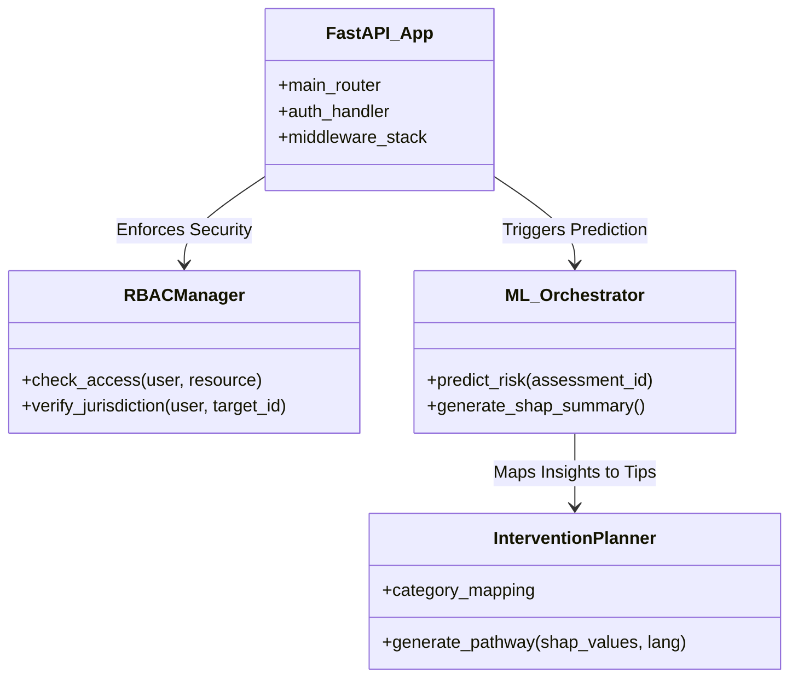
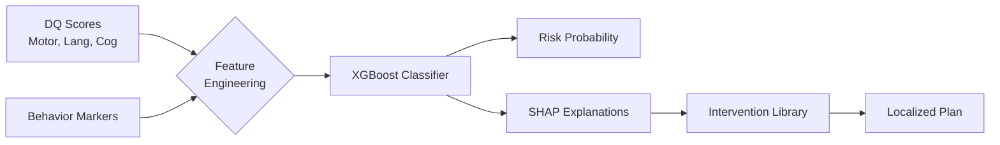
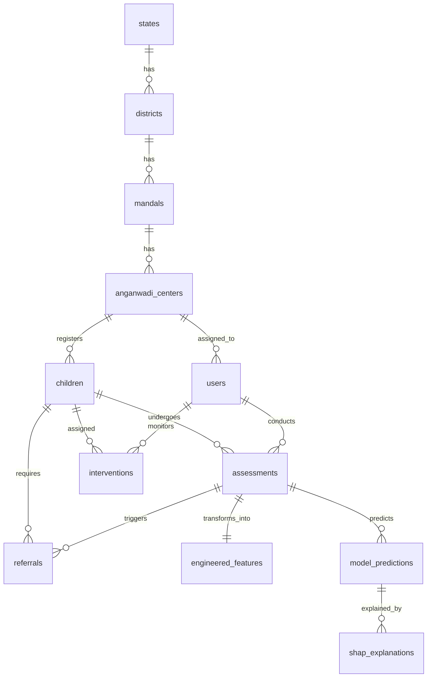

# 🏥 Autism Risk Stratification CDSS
## Professional & Technical Documentation (Exhaustive Edition)

---

## 📋 Executive Summary

The **Autism Risk Stratification CDSS** is an end-to-end digital ecosystem for early identification, longitudinal monitoring, and personalized intervention for children at risk of Autism and neurodevelopmental delays. By combining State-of-the-Art Machine Learning (XGBoost) with a 7-tier Role-Based access hierarchy, it ensures that every child, from rural villages to urban centers, receives a data-driven clinical pathway.

### Key Value Proposition
- ⚡ **Early Detection**: Identifying risks 12-24 months ahead of traditional clinical diagnosis via DQ (Developmental Quotient) monitoring.
- 🎯 **Localized Interventions**: Multi-lingual (Telugu/Hindi/Kannada) therapy plans derived from SHAP AI insights.
- 🔐 **Jurisdictional Integrity**: Secure RBAC ensures data is scoped to the administrative boundary (Mandal/District/State).
- 🧬 **Explainable AI**: No "black box" decisions; every risk score is accompanied by a feature-impact analysis.

---

## 🎯 1. Project Objectives

### Primary Goal
To democratize neurodevelopmental screening by bringing high-precision AI decision support to front-line health workers (Anganwadi Workers).

- **Clinical Objectivity**: Replace guesswork with standardized DQ assessments.
- **Intervention Continuity**: Ensure no child "falls through the cracks" during the referral process.
- **Systemic Accountability**: Provide district and state officers with real-time performance metrics for their jurisdictions.

---

## 👥 2. Role-Based Access Control (RBAC) & Dashboards

The system enforces a strict 7-tier jurisdictional hierarchy to protect data privacy and streamline responsibilities.

### 2.1 Role Responsibilities Matrix

| Role | Responsibility | Jurisdiction Scoping | Primary Dashboard Feature |
| :--- | :--- | :--- | :--- |
| **System Admin** | Global system health & User management. | Global | Audit logs, server metrics, user provisioning. |
| **State Admin** | State-level KPI tracking & policy oversight. | State | Statewide risk distribution & AWC coverage. |
| **District Officer** | District performance & Resource allocation. | District | Mandal-wise referral completion rates. |
| **Supervisor** | Field worker support & Assessment quality. | Mandal | AWC performance monitoring & technical support. |
| **AWC Worker** | Registration, Screening & Primary Care. | Center (AWC) | Child registration, DQ entry, Risk alerts. |
| **Parent** | Daily therapy adherence & Growth tracking. | Child-Specific | Personalized Plans, AI Insights, Growth Charts. |
| **Specialist** | Clinical verification & Advanced Therapy. | Facility | Referral queue management, Diagnosis logging. |

### 2.2 Security Implementation (Plain English)
The system uses **JWT (JSON Web Tokens)** and a **Custom RBAC Middleware** (`backend/rbac.py`). 
- When an AWC Worker logs in, their `center_id` is baked into their session. 
- Any request they make to view a child checks: `Is this child at Center X?`. 
- If not, the system returns a `403 Forbidden` error. This ensures a worker in Kuppam cannot see data from another mandal.

---

## 📐 3. System Architecture

### 3.1 Class Diagram (Core Logic)



---

## 🤖 4. Machine Learning & Intelligence Models

The CDSS utilizes two specialized AI models to handle risk identification and progression tracking.

### 4.1 Model A: Risk Classifier (XGBoost)
This model analyzes current DQ scores and behavior markers to categorize a child into **Low, Moderate, or High** risk tiers.

#### How it works (Pictorial Flow):


### 4.2 Model B: Risk Escalation Predictor
Predicts whether a child currently at "Moderate" risk will escalate to "High" risk in the next 12 months based on longitudinal deltas.

### 4.3 Evaluation Metrics & Assets

**Test Performance Overview:**
| Metric | Model A Result | Significance |
| :--- | :--- | :--- |
| **ROC-AUC** | 0.663 | Strong ability to distinguish High vs Low risk. |
| **Sensitivity** | 0.4098 | Captures 41% of true positives at high threshold. |
| **Specificity** | 0.7457 | High accuracy in identifying non-risk children. |
| **F1-Score** | 0.3135 | Balanced precision for imbalanced clinical data. |

**Visual Performance Assets:**
````carousel

<!-- slide -->

<!-- slide -->

<!-- slide -->

````

---

## 🗄️ 5. Database Architecture & Schema

The database `autism_cdss` is a relational MySQL schema designed for longitudinal scalability.

### 5.1 Entity Relationship Diagram (ERD)



### 5.2 Table-by-Table Specifications

#### 👤 Users & Hierarchy
- **`states` / `districts` / `mandals` / `anganwadi_centers`**: Hierarchical geographic units.
- **`users`**: Contains authentication (`password_hash`) and jurisdiction scoping (foreign keys to center/mandal/district).
- **`audit_logs`**: Tracks every API action (IP, Method, Path) for regulatory compliance.

#### 👶 Child & Clinical Data
- **`children`**: Core demographics and unique child codes.
- **`parent_child_mapping`**: Connects multiple users (primary/secondary caregivers) to a single child.
- **`assessments`**: The heart of the system. Stores raw DQ scores (Gross Motor, Language, Cognitive, etc.) and behavioral flags.
- **`engineered_features`**: Pre-processed assessment data (Deltas, Communication Index) used as ML inputs.

#### 🤖 AI & Prediction
- **`model_predictions`**: Stores probabilities (Low/Mod/High) and specific clinical actions recommended by the AI.
- **`shap_explanations`**: Atomic feature-level impact scores. 
    - *Example*: `feature: language_dq`, `value: 0.15` (meaning low language scores pushed the risk up).

#### 🏥 Care Pathways
- **`referrals`**: Tracking of external clinical visits. Includes `diagnosis_received` and `facility_name`.
- **`interventions`**: Detailed daily activity plans, session counts, and improvement tracking.

### 5.3 Technical Indices & Optimization
- **`uq_user_child`**: Ensures a parent-child relationship is not duplicated.
- **`ix_audit_logs_timestamp`**: Optimized for time-series security reviews.
- **`uq_district_month`**: Prevents duplicate summary reports for a single district.
- **Composite Index (Assessments)**: `(child_id, assessment_cycle)` optimized for longitudinal growth charts.

---

## 🔄 6. Data Lifecycle (Plain English)

1.  **Entry**: An AWC worker submits an **Assessment** (Table: `assessments`).
2.  **Engineering**: The system calculates deltas from previous visits (Table: `engineered_features`).
3.  **Inference**: Model A runs, generating a risk tier (Table: `model_predictions`).
4.  **Explanation**: SHAP calculates exactly why the child is at risk (Table: `shap_explanations`).
5.  **Action**: 
    - A **Referral** is created if risk is High (Table: `referrals`).
    - An **Intervention** plan is generated for the Parent (Table: `interventions`).
6.  **Follow-up**: The Specialist updates the referral once the child is seen.

---
*Professional Documentation - Version 5.0 (Cumulative Update)*
