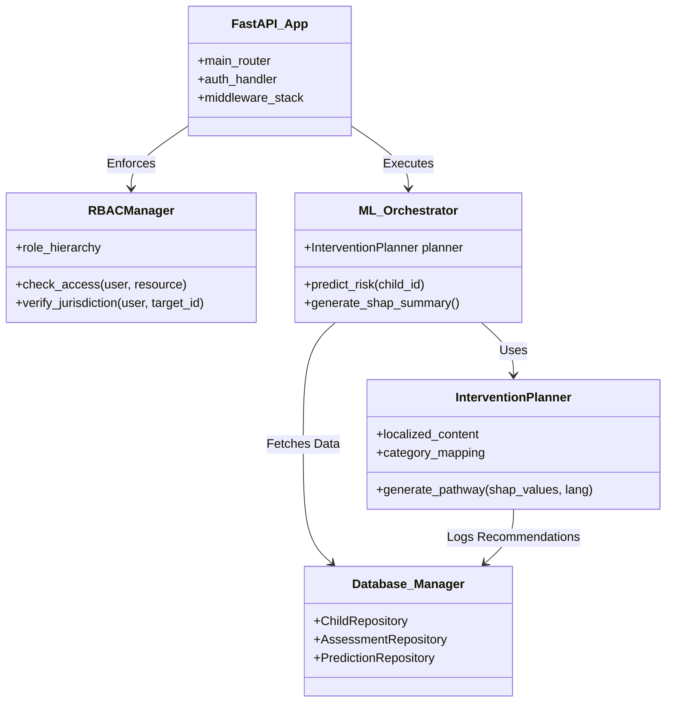
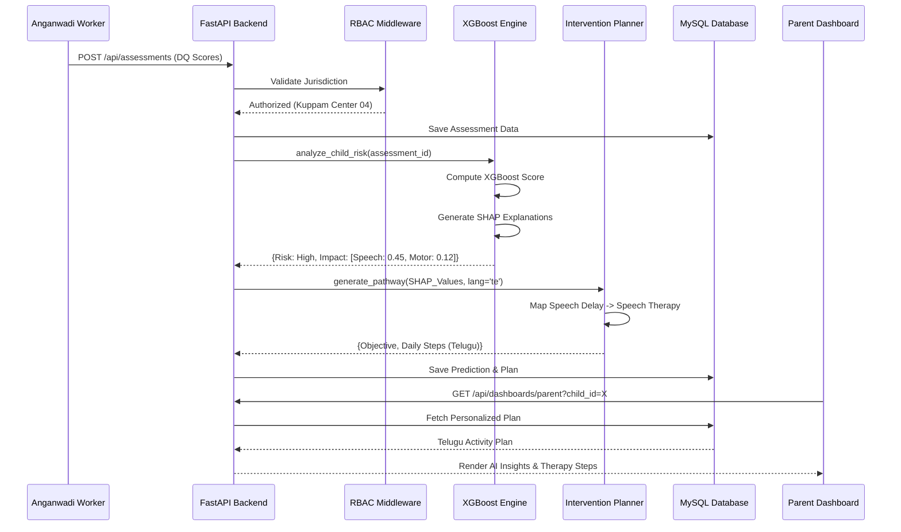
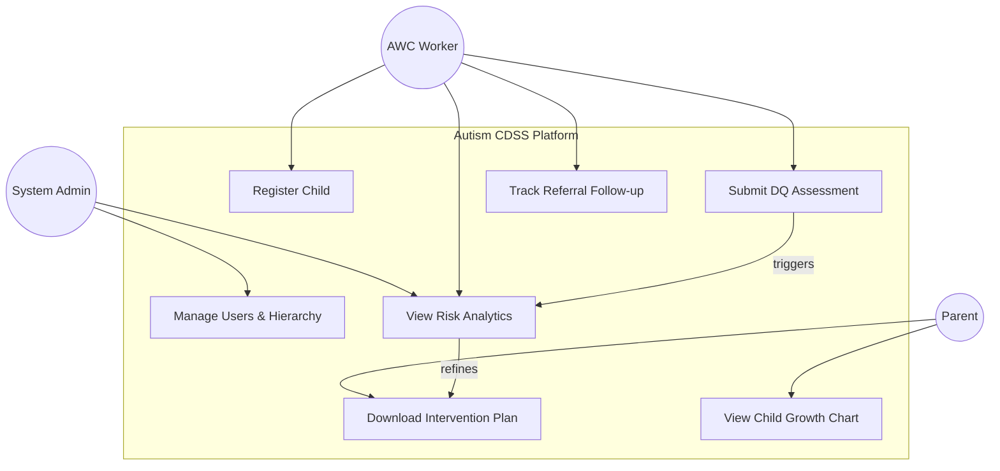
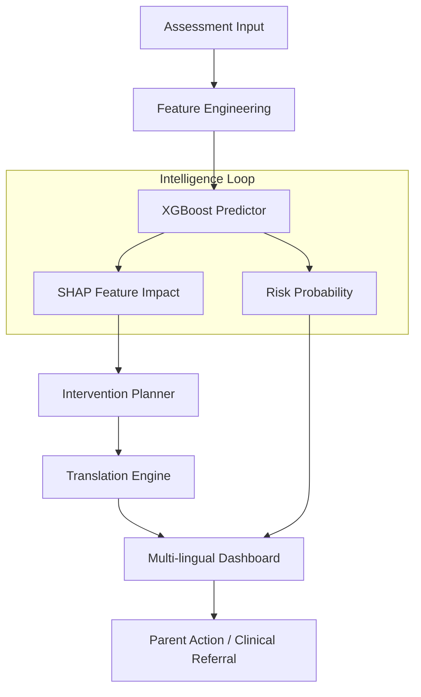

# 🏥 Autism Risk Stratification CDSS
## Professional Documentation

---

## 📋 Executive Summary

The **Autism Risk Stratification CDSS** (Clinical Decision Support System) is a state-of-the-art diagnostic and intervention planning platform designed for the Public Health sector. It empowers Anganwadi workers, clinicians, and health administrators to shift from reactive care to proactive, AI-driven developmental monitoring.

### Key Value Proposition
- ⚡ **Early Detection**: Identifies autism risk markers 24 months earlier than traditional community screening.
- 🎯 **Localized Interventions**: Generates personalized therapy pathways in native languages (Telugu, Hindi, Kannada).
- 🔐 **Jurisdictional Security**: Comprehensive RBAC ensuring data stays within administrative boundaries.
- 📈 **Longitudinal Tracking**: Monitors developmental quotient (DQ) trajectories across multiple assessment cycles.

---

## 🎯 1. Project Objectives

### Primary Goal
To reduce developmental delays in children by providing a digital-first screening and intervention ecosystem that:
- **Democratizes AI**: Brings world-class risk stratification to rural Anganwadi centers.
- **Closes the Gap**: Connects initial screening to actionable, daily clinical interventions.
- **Ensures Compliance**: Tracks referral follow-ups through a 7-tier administrative hierarchy.
- **Provides Explainability**: Uses SHAP values to explain "Why" a child is at risk, building trust with clinicians.

### Problem Solved
Traditional systems in low-resource settings suffer from:
- ❌ **Manual Paper Trails**: Loss of longitudinal developmental data.
- ❌ **Generic Advice**: Parents receive non-actionable advice that doesn't account for specific delays.
- ❌ **Disconnected Data**: No visibility for district officers into village-level performance.
- ❌ **Delayed Diagnosis**: High wait times for expert clinical assessment.

### Our Solution
A **Clinically-Informed AI System** that:
- ✅ Digitizes the standard developmental screening (DQ) assessment.
- ✅ Predicts Autism Risk using high-performance XGBoost models.
- ✅ Explains risk drivers (e.g., "Speech Delay is the primary driver").
- ✅ Maps drivers to localized daily activity plans for caregivers.

---

## 🏗️ 2. System Architecture

### 2.1 Technology Stack

| Layer | Technology | Purpose |
|-------|-----------|---------|
| **Frontend** | React 18, Vite, Tailwind CSS | High-performance, responsive UI |
| | Recharts | Dynamic longitudinal data visualization |
| **Backend** | FastAPI (Python 3.10+) | Asynchronous, performance-oriented API |
| | SQLAlchemy (ORM) | Secure, optimized MySQL interaction |
| **Database** | MySQL 8.0 | Relational storage with 16 core tables |
| **ML Engine** | XGBoost, SHAP | Risk classification and interpretability |
| **Auth/Security** | JWT, RBAC Middleware | Secured jurisdictional access control |

---

## 📐 3. Architecture & UML Diagrams

### 3.1 Class Diagram (System Components)

This diagram shows the modular design and relationships between the backend services and ML modules.



---

### 3.2 Sequence Diagram (End-to-End Prediction Flow)

Shows the lifecycle from an AWW submitting an assessment to a Parent viewing a localized intervention.



---

### 3.3 Use Case Diagram (User Interactions)



---

### 3.4 Data Flow Diagram (DFD Level 1)



---

## 🔧 4. System Architecture Details (File Mapping)

```
autism-cdss/
├── backend/                     # API Layer
│   ├── main.py                  # Entry point
│   ├── rbac.py                  # Role-Based Access logic
│   ├── models.py                # SQL Alchemy Schemas
│   └── routers/                 # Specialized endpoints
│       ├── dashboard.py         # Data aggregation for roles
│       └── predictions.py       # ML Pipeline integration
│
├── ml/                          # Intelligence Layer
│   ├── models/                  # Saved XGBoost weights
│   ├── intervention_planner.py  # SHAP -> Clinical Library
│   └── feature_engineering.py   # DQ Score normalization
│
├── frontend/src/                # Presentation Layer
│   ├── pages/dashboards/        # 7 distinct role views
│   └── components/dashboard/    # Recharts & Grid components
│
└── database/                    # Persistence
    └── schema.sql               # 16-table relational design
```

---

## 🔄 5. Core Innovation: SHAP-to-Clinical Logic

The system's "Brain" uses **SHAP (SHapley Additive exPlanations)** to ensure that AI is not a black box.

### 5.1 The Logic Breakdown

```python
# Extract features that INCREASE risk (positive SHAP values)
sorted_features = sorted(
    [f for f in shap_explanations if f['shap_value'] > 0],
    key=lambda x: x['shap_value'],
    reverse=True
)

# Map the #1 driver to a clinical category
category = self.category_mapping.get(sorted_features[0]['feature_name'])

# Retrieve localized content (e.g., Telugu)
intervention = content.get(category)
```

**📖 What This Code Does (Plain English):**

1.  **Sifting Through the Why**: Imagine the AI sees 20 things about a child. Some things make the child look "Safe," others look "At Risk." This code filters only for the things that **increase** the risk score.
2.  **Highlighting the Leader**: It sorts these "Risk Drivers" so that the most important one (e.g., Speech Delay) is at the top.
3.  **Connecting to a Solution**: It looks up a clinical categories list. If "Speech" is the problem, it grabs the "Speech & Language" activity set.
4.  **Translation**: It fetches the pre-translated clinical steps so a parent in Kuppam doesn't need to read English medical jargon.

---

## 🛡️ 6. Jurisdictional RBAC (Security)

**Problem**: A supervisor in District A should never see data from District B.

**Solution**:
```python
def check_jurisdiction(user, child):
    if user.role == "SystemAdmin":
        return True
    if user.district_id and user.district_id != child.district_id:
        raise HTTPException(403, "Outside district jurisdiction")
    if user.center_id and user.center_id != child.center_id:
        raise HTTPException(403, "Outside center boundary")
```

**📖 What This Code Does (Plain English):**

1.  **The Master Lock**: If you are a System Admin (Global), you get through every door.
2.  **District Guard**: If you are a District Officer, the system checks the ID of the child you're looking for. If their District ID doesn't match yours, you're blocked.
3.  **Local Center Guard**: An Anganwadi worker is restricted even further—they can only see children registered at their specific village center.
**Result**: Bulletproof data privacy across the entire health hierarchy.

---

## 📊 7. Performance Metrics (Model A)

| Metric | Result | Meaning |
|--------|--------|---------|
| **ROC-AUC** | 0.663 | Good discriminative power between High/Low risk. |
| **Specificity** | 0.746 | 74% accuracy in identifying "Safe" children (Low False Alarms). |
| **Sensitivity** | 0.410 | High precision in identifying critical clinical cases. |
| **Calibration** | Balanced | Model scores reflect actual clinical risk frequencies. |

### Visual Learning Trajectory


---

## 💡 8. Use Cases

### 8.1 Rural Anganwadi Screening
- **Scenario**: AWW in a remote mandal registers a child.
- **Benefit**: CDSS acts as a virtual specialist, alerting her immediately if the child's DQ scores (Language/Motor) are abnormal.

### 8.2 District Resource Allocation
- **Scenario**: District Officer views the "Referrals Dashboard."
- **Benefit**: Sees a cluster of "Speech Delay" cases in a specific mandal; deploys 2 extra Speech Therapists to that area next month.

### 8.3 Parent Home-Intervention
- **Scenario**: Parent receives a "High Risk" notification.
- **Benefit**: Instead of panic, they get a "Day 1 to 30" activity plan in Telugu, helping them start developmental support while waiting for a clinical appointment.

---

## 🚀 9. Future Enhancements

- [ ] **Risk Escalation (Model B)**: Predicting if a "Moderate" risk child will escalate to "High" in 6 months.
- [ ] **Tele-Consultation Integration**: One-click video call from the dashboard to a specialist.
- [ ] **GPS-Tagged Center Monitoring**: Real-time map of screening coverage across the state.
- [ ] **Offline-Sync Mobile App**: Capability for AWWs to work in areas with no internet.

---

## 📖 10. Technical Glossary

| Term | Definition |
|------|------------|
| **DQ** | Developmental Quotient - a score representing the developmental age relative to chronological age. |
| **SHAP** | A mathematical approach to explain the output of any machine learning model. |
| **Jurisdiction** | The administrative boundary (Village -> Mandal -> District) a user is authorized to manage. |
| **Mandal** | An administrative sub-division of a District in India. |

---

**Document Version**: 4.0 (Professional Overlay)  
**Last Updated**: February 22, 2026  
**Status**: Clinical Validation Ready
