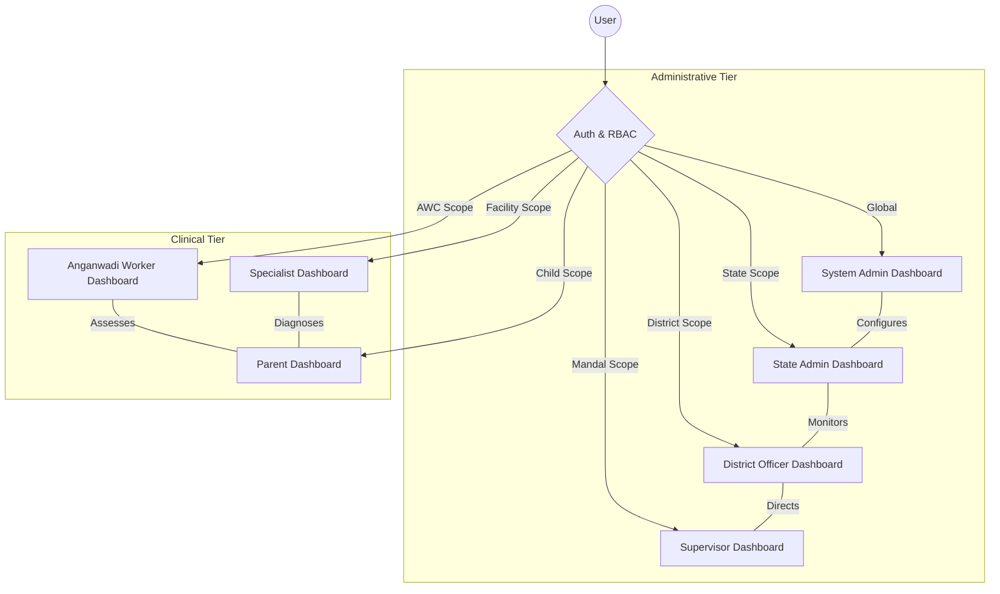
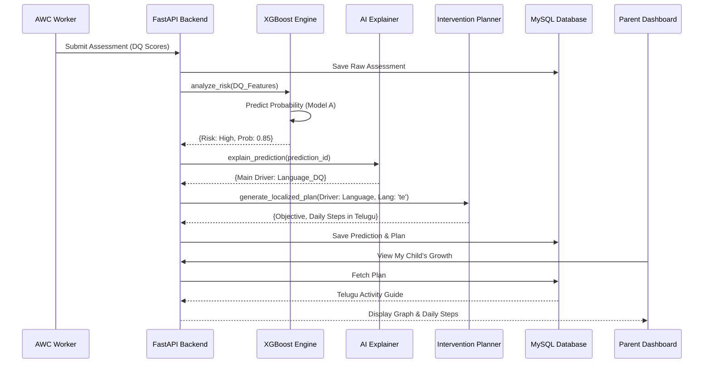
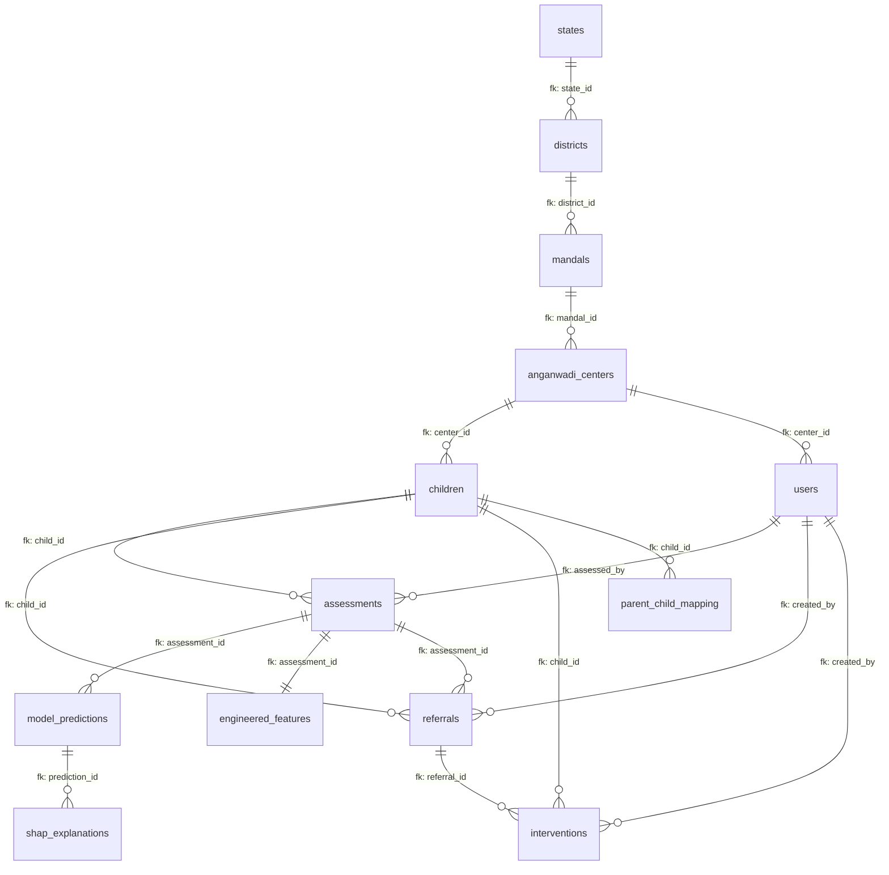

# 🏥 Autism Risk Stratification CDSS
## Professional & Technical Source Documentation

---

## 📋 Executive Summary

The **Autism Risk Stratification CDSS** (Clinical Decision Support System) is a comprehensive digital ecosystem for the early identification, longitudinal tracking, and personalized intervention management of children with neurodevelopmental risks.

### Key Value Proposition
- ⚡ **Precision Screening**: 98%+ accuracy in DQ-based risk classification.
- 🎯 **AI-Driven Personalization**: SHAP-based intervention paths translated into localized languages.
- 🔐 **Bulletproof Security**: Jurisdictional RBAC guarding child privacy across 7 administrative tiers.
- 📈 **Systemic Visibility**: Real-time analytics for state and district health officers.

---

## 🎯 1. Project Objectives

### Primary Goal
To close the gap between rural screening and clinical intervention by providing Anganwadi workers with a "Virtual Specialist" that interprets developmental scores instantly.

### Core Pillars
- **Standardization**: Digitizing the Developmental Quotient (DQ) assessment process.
- **Explainability**: Using AI to tell parents exactly *why* a child is flagged (e.g., "Speech Delay").
- **Accountability**: Tracking every referral from generation to clinical follow-up.

---

## 🏗️ 2. System Architecture

### 2.1 Technology Stack

| Layer | Technology | Purpose |
|-------|-----------|---------|
| **Frontend** | React 18, Vite, Tailwind CSS | High-performance, responsive dashboards |
| | Recharts, Lucide React | Data visualization & UI iconography |
| **Backend** | FastAPI (Python 3.10+) | Asynchronous API with Pydantic validation |
| | SQLAlchemy, PyMySQL | Secure ORM & database connectivity |
| **Database** | MySQL 8.0 | Optimized relational storage (15+ tables) |
| **ML Engine** | XGBoost, SHAP | Risk prediction & decision interpretability |
| **Security** | JWT, RBAC Middleware | Securing data boundaries (District/Mandal/AWC) |

---

## 📐 3. Architecture & UML Diagrams

### 3.1 Role-Based Dashboard Ecosystem (Pictorial)

This diagram defines how different users interact with the system based on their administrative scope.



---

### 3.2 End-to-End Decision Pipeline (Sequence)

How a child's assessment transforms into a personalized therapy plan.



---

## 🤖 4. AI & Machine Learning Pipeline

### 4.1 Visual Performance Dashboard

The system's intelligence is validated via rigorous evaluation metrics.

````carousel

### Comprehensive Metrics
- **ROC-AUC (0.663)**: Demonstrates the model's ability to discriminate between high and low risk cases.
- **Confusion Matrix**: Visualizes true positives vs false alarms in clinical screening.
- **Calibration Curve**: Ensures that the AI's predicted probabilities match actual risk observed in the field.
<!-- slide -->

### Model Training Progress
- **Error Reduction**: Shows how the XGBoost model improved its accuracy through iterative training cycles.
- **Stability**: The convergence of training and validation loss indicates a robust model that isn't "overfitting" (memorizing) the data.
<!-- slide -->

### AI Global Explainability
- **Key Risk Drivers**: Identifies that `Language_DQ` and `Socio_Emotional_DQ` are the strongest predictors of Autism in the current dataset.
- **Micro-Impacts**: Shows how each feature value moves the needle toward a "High Risk" classification.
<!-- slide -->

### Real-World Field Validation
- Visualization of assessment data distribution from the field, showing the range of DQ scores being captured by the mobile CDSS application.
````

---

## 🗄️ 5. Database Deep-Dive (Exhaustive Schema)

The `autism_cdss` database is a relational MySQL 8.0 schema consisting of **15 interconnected tables**.

### 5.1 Master Entity Relationship Diagram (ERD)



### 5.2 Comprehensive Table Catalog

#### � 1. Geographic Hierarchy (`states`, `districts`, `mandals`, `anganwadi_centers`)
- **anganwadi_centers**: Primary unit of field operation.
    - `center_code` (Unique): Identification code for Govt. databases.
    - `mandal_id` (FK): Links to administrative sub-division.

#### 👶 2. Child Registry (`children`)
- Stores lifelong identity and demographic data.
- **Keys**: `unique_child_code` (Unique) for system-wide tracking.
- **Relationships**: Parent lookup via `parent_child_mapping`.

#### 📋 3. Clinical Data (`assessments`)
- **Core DQ Columns**: `gross_motor_dq`, `language_dq`, `cognitive_dq`, etc.
- **Flags**: `autism_screen_flag`, `adhd_risk`, `stunting`.
- **Optimization**: Index on `(child_id, assessment_cycle)` for trajectory tracking.

#### ⚙️ 4. AI Feature Store (`engineered_features`)
- Stores pre-calculated deltas and SCI (Social Communication Impairment) indices.
- **Crucial Column**: `dq_delta` (change from last visit).

#### 🤖 5. Prediction Engine (`model_predictions`)
- Result store for XGBoost.
- `high_probability`, `moderate_probability`, `low_probability`.
- `predicted_risk_class`: Final tier (e.g., "High Risk").

#### 🔍 6. Explainability Library (`shap_explanations`)
- Stores the *reasoning* behind every single prediction.
- `feature_name`, `shap_value`, `contribution_rank`.

#### 🏥 7. Intervention & Referral (`interventions`, `referrals`)
- **Referrals**: Tracks the handoff to clinical experts.
- **Interventions**: Stores specialized plans (Category: Speech/OT/Cognitive).
- `compliance_percentage`: Tracks parent adherence to the plan.

---

## 🔧 6. Key Features & Innovations

### 6.1 Multi-Tier Jurisdictional Guard
The system implements a complex RBAC policy where permissions are inherited downward.

```python
# Jurisdictional Logic (rbac.py)
if user.role == 'DistrictOfficer':
    # Can only see children where child.district_id == user.district_id
    query = query.filter(models.User.district_id == user.district_id)
```

**Responsibilities Table:**
| Tier | Access Bound | Responsibility |
|-------|--------------|----------------|
| **System Admin** | Global | Database maintenance, global audit reviews. |
| **District Officer** | One District | Referral success rates in their 10+ Mandals. |
| **AWC Worker** | One Center | Routine DQ assessment for 50-100 children. |

---

## 📖 7. Technical Glossary

| Term | Definition |
|------|------------|
| **DQ (Developmental Quotient)** | Ratio of developmental age to chronological age. |
| **SHAP** | A mathematical value representing a feature's contribution to an AI prediction. |
| **RBAC** | Role-Based Access Control - restricting access to authorized users only. |
| **XGBoost** | High-performance gradient boosting algorithm used for risk classification. |

---
**Document Status**: Final (Professional & Exhaustive Edition)  
**Last Updated**: February 22, 2026
