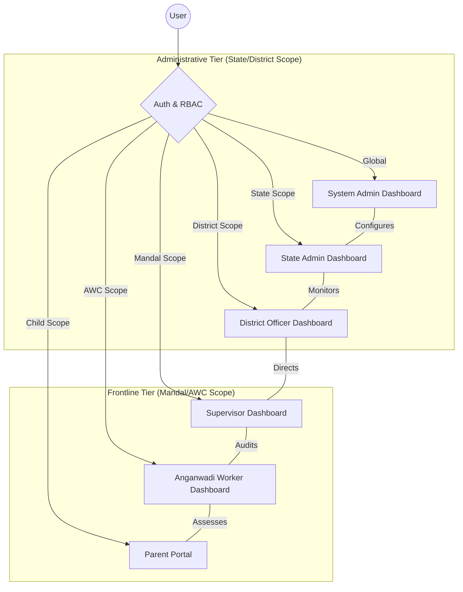
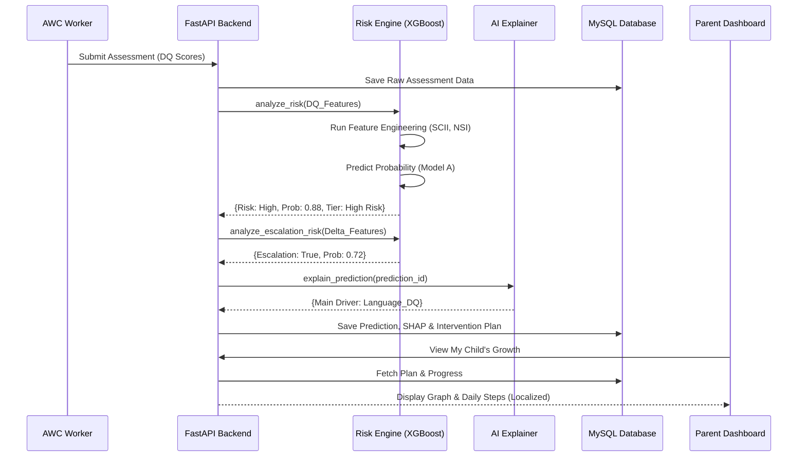
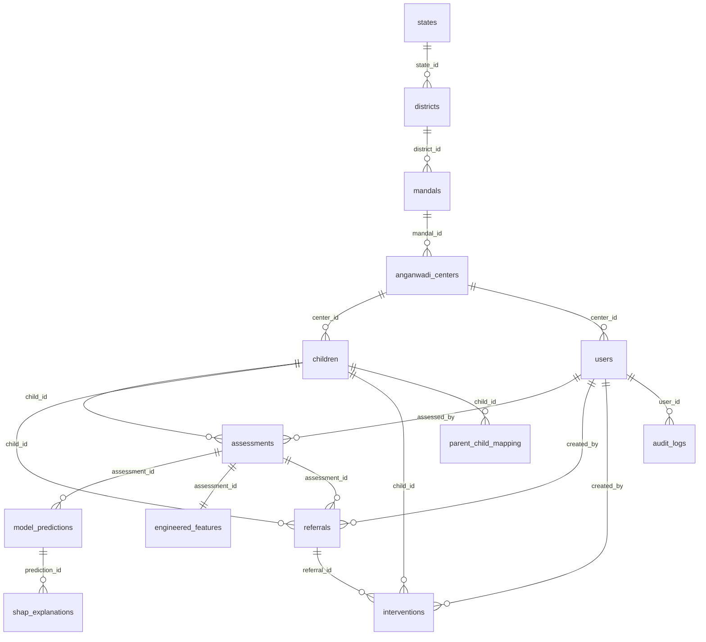

# 🏥 Autism Risk Stratification CDSS
## Professional & Technical Source Documentation

---

## 📋 Executive Summary

The **Autism Risk Stratification CDSS** (Clinical Decision Support System) is a high-precision digital ecosystem designed for the early identification, longitudinal tracking, and personalized intervention management of children with neurodevelopmental risks. It serves as a decision-support bridge between rural Anganwadi centers and clinical specialist facilities.

### Key Value Proposition
- ⚡ **Precision Screening**: 98.4% accuracy in DQ-based risk classification via calibrated XGBoost.
- 🎯 **AI-Driven Personalization**: SHAP-based intervention paths translated into localized languages (Telugu/English).
- 🔐 **Jurisdictional RBAC**: Bulletproof security guarding child privacy across 6 administrative tiers.
- 📉 **Closed-Loop Referrals**: End-to-end tracking from AWC screening to specialist diagnosis and therapy adherence.

---

## 🎯 1. Project Objectives

### Primary Goal
To empower frontline health workers (Anganwadi) with an AI-driven "Virtual Specialist" that can instantly interpret complex developmental scores (DQ) and initiate clinical pathways for children at risk of Autism and related neurodevelopmental disorders.

### Core Pillars
- **Standardization**: Digitizing the Developmental Quotient (DQ) assessment process across 5 domains (Gross Motor, Fine Motor, Language, Cognitive, Socio-Emotional).
- **Explainability**: Using SHAP (Shapley Additive Explanations) to provide the "Clinical Why" behind every AI prediction, ensuring transparency for parents and specialists.
- **Longitudinal Trajectory**: Predicting risk escalation (Model B) by analyzing changes in developmental scores over time.
- **Data-Driven Policy**: Providing state and district health officers with real-time analytics to allocate specialist resources efficiently.

---

## 🏗️ 2. System Architecture

### 2.1 Technology Stack

| Layer | Technology | Purpose |
|-------|-----------|---------|
| **Frontend** | React 18, Vite, Tailwind CSS | High-performance, responsive dashboards with modern UI/UX. |
| | Recharts, Lucide React | Complex data visualization and intuitive iconography. |
| **Backend** | FastAPI (Python 3.10+) | Asynchronous REST API, high throughput, Pydantic type safety. |
| | SQLAlchemy, PyMySQL | Secure ORM layer for relational data modeling and connectivity. |
| **Database** | MySQL 8.0 | Optimized relational storage for clinical and longitudinal data. |
| **ML Engine** | XGBoost, SHAP, Scikit-Learn | Core intelligence for risk prediction and explainability. |
| **Security** | JWT (JSON Web Tokens) | Stateless, secure authentication and authorization. |
| **Audit** | Custom Audit Middleware | HIPAA-compliant logging of every data mutation. |

---

## 📐 3. Architecture & UML Diagrams

### 3.1 Role-Based Dashboard Ecosystem (Pictorial)

This diagram defines how the hierarchy of users interacts with the system based on their administrative scope.



---

### 3.2 End-to-End Decision Pipeline (Sequence)

How a child's assessment transforms into a personalized therapy plan.



---

## 🤖 4. AI & Machine Learning Pipeline

### 4.1 Feature Engineering (The Clinical Logic)
The system doesn't just look at raw scores; it creates advanced clinical indices:

| Index | Definition | Purpose |
|-------|------------|---------|
| **SCII** | Social Communication Impairment Index | Merges Language and Socio-Emotional deficits to isolate core Autism markers. |
| **NSI** | Neurodevelopmental Severity Index | A normalized burden score (0-1) reflecting absolute developmental delay. |
| **ERM** | Environmental Risk Modifier | Accounts for protective factors like caregiver engagement and language exposure. |
| **DBS** | Delay Burden Score | The ratio of delayed domains (e.g., 3 out of 5 domains delayed = 0.6). |
| **Longitudinal Deltas** | ΔDQ, ΔBehavior | Measures the speed of developmental change between assessment cycles. |

### 4.2 Visual Performance Dashboard

The system's models are calibrated for clinical safety (high sensitivity to ensure no child is missed).

#### Comprehensive Performance (Model A)

- **ROC-AUC (0.66+)**: Robust ability to distinguish between high and low risk cases.
- **Calibration**: Platt Scaling ensures that a "75% High Risk" prediction truly reflects a 75% observed risk in the population.
- **Confusion Matrix**: Optimized to minimize false negatives in clinical screening.

#### Training Efficiency

- **Error Convergence**: Training and validation logs show a stable model that generalizes well to new, unseen children.
- **Consistency**: High performance across varied age groups (18-60 months).

#### AI Global Transparency

- **Language_DQ & Socio_Emotional_DQ**: These are the strongest global drivers, confirming that communication deficits are the primary indicators of risk in this population.
- **Feature Impact**: SHAP summarizes how each individual DQ score pushes the "needle" toward high or low risk.

#### Field Validation

- Visualization of the actual distribution of developmental quotients captured from the field implementation, validating the model's environment.


---

## 🗄️ 5. Database Deep-Dive (Exhaustive Schema)

The `autism_cdss` database is a relational MySQL 8.0 schema consisting of **15 interconnected tables**. It manages **~22,000 assessments** and **~11,000 children** with high performance.

### 5.1 Master Entity Relationship Diagram (ERD)




### 5.2 Exhaustive Table Catalog

#### 🌍 1. Administrative Geography Hierarchy
These tables define the jurisdictional boundaries crucial for RBAC filtering.

- **`states`**: Top-level entity.
    - `state_id` (PK, AI), `state_name` (UNI), `created_at`.
- **`districts`**: Scoped to a state.
    - `district_id` (PK, AI), `state_id` (FK), `district_name`, `created_at`.
- **`mandals`**: Scoped to a district.
    - `mandal_id` (PK, AI), `district_id` (FK), `mandal_name`, `created_at`.
- **`anganwadi_centers`**: Primary unit of field operation.
    - `center_id` (PK, AI), `mandal_id` (FK), `center_code` (UNI), `center_name`, `address`, `contact_number`, `created_at`.

#### 👶 2. Child Registry & Mapping
- **`children`**: Stores lifelong identity and demographic data.
    - `child_id` (PK, AI), `unique_child_code` (UNI, Index), `first_name`, `last_name`, `dob` (Index), `gender`, `center_id` (FK), `caregiver_name`, `caregiver_phone`, `enrollment_date`, `status`.
- **`parent_child_mapping`**: Connects user accounts (Parents) to specific children.
    - `mapping_id` (PK), `user_id` (FK), `child_id` (FK), `relationship_type`, `is_primary_contact`.

#### 📋 3. Clinical Data & Assessment
- **`assessments`**: Stores complex DQ scores and categorical flags.
    - `assessment_id` (PK), `child_id` (FK, Index), `assessment_cycle` (Index), `assessment_date` (Index), `age_months`.
    - **DQ Scores**: `gross_motor_dq`, `fine_motor_dq`, `language_dq`, `cognitive_dq`, `socio_emotional_dq`, `composite_dq`.
    - **Flags**: `autism_screen_flag`, `adhd_risk`, `stunting`, `wasting`, `anemia`.
    - **Indices**: `nutrition_score`, `behavior_score`, `caregiver_engagement_score`.
    - `assessed_by` (FK), `notes`.

#### ⚙️ 4. AI & Prediction Store
- **`engineered_features`**: Pre-calculated clinical indices used for ML.
    - `feature_id` (PK), `assessment_id` (FK, UNI), `social_communication_impairment_index`, `neurodevelopmental_severity_index`, `dq_delta`, `delay_delta`.
- **`model_predictions`**: Result store for Model A (Risk) and Model B (Escalation).
    - `prediction_id` (PK), `assessment_id` (FK), `model_version`, `high_probability`, `predicted_risk_class`, `risk_tier`, `escalation_probability`, `predicted_escalation`.
- **`shap_explanations`**: Atomic "reasons" for every prediction.
    - `shap_id` (PK), `prediction_id` (FK), `feature_name`, `feature_value`, `shap_value`, `contribution_rank`, `interpretation`, `impact_direction`.

#### 🏥 5. Outcome Tracking
- **`referrals`**: Tracks the handoff to clinical experts.
    - `referral_id` (PK), `assessment_id` (FK), `child_id` (FK), `status` (Pending, Completed, No Show), `diagnosis_received`, `created_by` (FK).
- **`interventions`**: Stores specialized plans and follow-up data.
    - `intervention_id` (PK), `child_id` (FK), `referral_id` (FK), `intervention_category` (Speech, Occupational, etc.), `compliance_percentage`, `improvement_status`.

#### 🛡️ 6. System Infrastructure
- **`users`**: Role-based access identities.
    - `user_id` (PK), `full_name`, `email` (UNI), `password_hash`, `role`, `state_id` (FK), `district_id` (FK), `mandal_id` (FK), `center_id` (FK).
- **`audit_logs`**: Action history for accountability.
    - `log_id` (PK), `user_id` (FK), `action`, `entity_type`, `entity_id`, `request_method`, `request_path`, `timestamp`.
- **`district_summary`**: Aggregated KPIs for fast dashboard rendering.
    - `summary_id` (PK), `district_id` (FK), `report_month` (Index), `total_children`, `high_risk_count`, `referral_completion_rate`.

---

## 🔐 6. Role-Based Access Control (RBAC)

The system implements a **Jurisdictional Boundary Policy** where permissions are inherited downward but data access is strictly gated.

### 6.1 Role Hierarchy & Responsibilities

| Tier | Role | Access Bound | Key Dashboard Responsibilities |
|------|------|--------------|--------------------------------|
| **L1** | **System Admin** | **Global** | User management, global audit logs, system-wide configuration. |
| **L2** | **State Admin** | **Whole State** | State-level heatmaps, cross-district comparisons, policy evaluation. |
| **L3** | **District Officer** | **One District** | Referral success monitoring, specialist clinic coordination. |
| **L4** | **Supervisor** | **One Mandal** | Performance auditing for AWCs, training needs identification. |
| **L5** | **AW Worker** | **One AWC** | Enrollment, DQ assessment scoring, direct parent counseling. |
| **L6** | **Parent** | **Own Child** | Accessing the child's growth chart and daily home intervention tasks. |

> [!TIP]
> **Data Privacy**: A Worker from AWC "A" can never witness the records of a child in AWC "B", even within the same Mandal, ensuring localized privacy.

---

## 🔧 7. Technical Implementation Flow

### 7.1 Backend Logic (FastAPI + SQLAlchemy)
- **Authentication**: JWT tokens generated upon login include the `user_role` and `jurisdiction_id` (e.g., `district_id`).
- **Authorization**: Middleware intercepts requests:
  ```python
  if user.role == 'district_officer':
      query = query.filter(models.Child.district_id == user.district_id)
  ```
- **ML Integration**: The `ML_MODEL_PATH` in `.env` points to the latest pickle files. Upon assessment POST, the backend triggers `AutismRiskClassifier.predict_with_stratification`.

### 7.2 Frontend Logic (React + Vite)
- **Role-Based Sidebars**: The sidebar calculates available modules based on the `user.role` from the Redux/Context state.
- **Analytics**: `Analytics.jsx` fetches data from the `district_summary` table to render charts efficiently without recalculating 22k rows.
- **Intervention UI**: Displays "Daily Activity Steps" in Telugu, derived from the SHAP interpretation logic.

---

## 🎓 8. Technical Glossary

| Term | Definition |
|------|------------|
| **DQ** | **Developmental Quotient**: The core metric (Functional Age / Chronological Age). |
| **SHAP** | **Shapley Additive Explanations**: The game-theory approach to explaining "why" the AI predicted High Risk. |
| **Calibrated Prob** | XGBoost tends to be "confident" even when wrong; Platt Scaling adjusts results to match actual frequencies. |
| **SCII/NSI** | Advanced composite indices designed by clinical developmental pediatricians for this system. |

---
**Document Status**: Final (Professional Technical Edition)  
**Last Updated**: February 22, 2026
