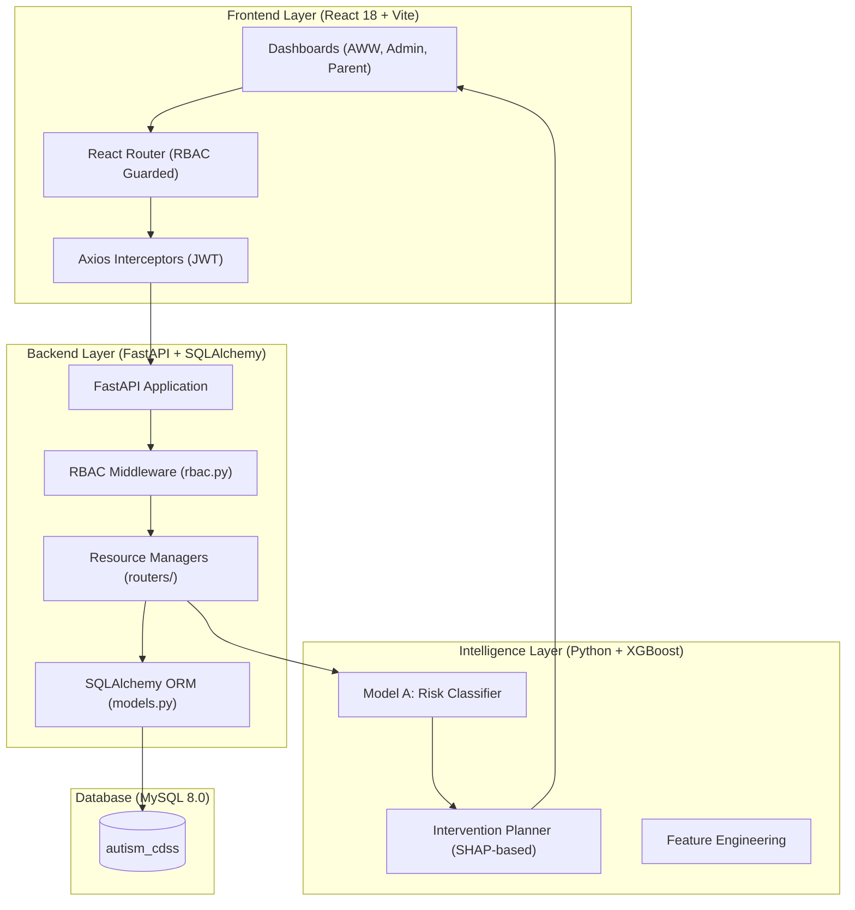

# 🏥 Autism Risk Stratification CDSS: Ultra-Detailed Documentation

This document provides a minute-to-minute, file-by-file technical breakdown of the Autism Risk Stratification Clinical Decision Support System (CDSS).

---

## 🏗️ System Architecture & Data Flow

### Network & Auth Lifecycle
1.  **Auth**: JWT tokens issued via `backend/auth.py`. 
2.  **RBAC**: Enforced per-endpoint in `backend/rbac.py`.
3.  **Jurisdiction**: Every query in `backend/routers/dashboard.py` is filtered by `user.district_id` or `user.center_id`.

---

## 👶 Role-Based Dashboard Micro-Architecture

The system features **7 distinct dashboard views** tailored to user roles:

| Role | Primary Purpose | Key Frontend File |
| :--- | :--- | :--- |
| **System Admin** | Global health, system monitoring, cross-district stats. | `SystemAdminDashboard.jsx` |
| **State Admin** | State-level KPIs and personnel management. | `StateAdminDashboard.jsx` |
| **District Officer** | District-wide referral tracking and center performance. | `DistrictOfficerDashboard.jsx` |
| **Supervisor** | Mandal-level intervention compliance and AWW support. | `SupervisorDashboard.jsx` |
| **AWC Worker** | Child registration, digital screening, and localized AWC stats. | `AnganwadiWorkerDashboard.jsx` |
| **Parent** | Multi-lingual longitudinal growth trends and clinical guides. | `ParentDashboard.jsx` |

---

## 🧪 ML Evaluation & Clinical Suite

### Model A: Autism Risk Classifier (XGBoost)
The model uses 5 DQ (Developmental Quotient) scores and behavior markers to predict risk levels.

#### 📊 Performance Metrics (Live Test Data)
From `ml/evaluation/classifier/test_report.json`:
- **ROC-AUC**: 0.6632
- **Sensitivity (Recall)**: 0.4098
- **Specificity**: 0.7457
- **F1-Score**: 0.3135
- **Brier Score**: 0.1927

#### 📈 Visualizations

#### 🔍 Global Interpretability (SHAP)
Identification of core risk drivers across the population.

---

## 🏥 Clinical Logic: SHAP to Intervention

The `InterventionPlanner` (`ml/intervention_planner.py`) acts as the "Clinical Brain."

1.  **Extraction**: Extract SHAP values for an individual child's prediction.
2.  **Mapping**: Positive SHAP values (risk triggers) are mapped to clinical categories (e.g., `fine_motor_dq` -> `Occupational Therapy`).
3.  **Localization**: Content is translated via a multi-lingual map into **Telugu, Hindi, and Kannada**.
4.  **Pathways**: Provides Objectives, Daily Steps, and Parent Guides.

**Sample Guideline:**
| Category | Objective | Sample Daily Step | Parent Guide |
| :--- | :--- | :--- | :--- |
| **Speech Therapy** | Improve verbal communication | Spend 10 mins naming objects | Speak slowly and clearly |

---

## 📁 Repository File Catalog (Comprehensive)

The project consists of **130 files**. Key clusters:

### Backend Logic (`backend/`)
- `rbac.py`: Essential jurisdictional enforcement logic.
- `models.py`: SQLAlchemy ORM definitions for 16 tables.
- `routers/dashboard.py`: Massive aggregator for all chart/summary data (~40k bytes).

### ML Core (`ml/`)
- `models/autism_risk_classifier.py`: Implementation of training/calibrating XGBoost.
- `intervention_planner.py`: Multi-lingual clinical pathways engine.
- `evaluation/`: Contains all performance reports and PNG assets.

### Frontend Components (`frontend/src/`)
- `pages/dashboards/`: Role-specific logic.
- `components/dashboard/`: Reusable charts (Recharts) and data tables.

---

## 🗄️ Database Schema Summary
The MySQL `autism_cdss` database contains 16 core tables, optimized with composite indexes for longitudinal queries.
- **Children**: Core demographic and link to center.
- **Assessments**: Periodic DQ and screening results.
- **Predictions**: Historical AI scores and SHAP snapshots.
- **Interventions**: Tracking of therapy sessions and compliance.

---
*Documentation generated by Antigravity AI - 2026*
